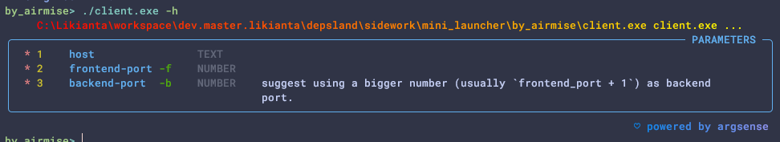
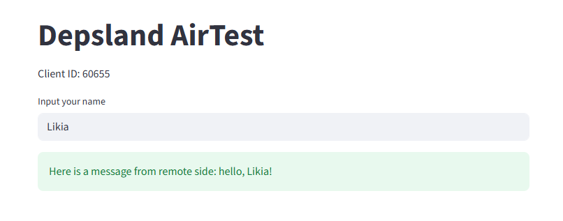
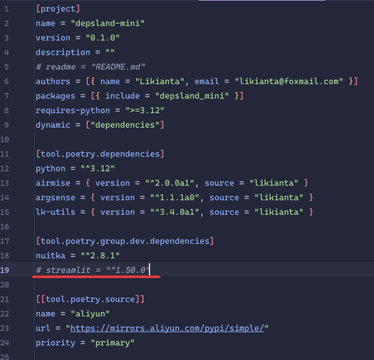
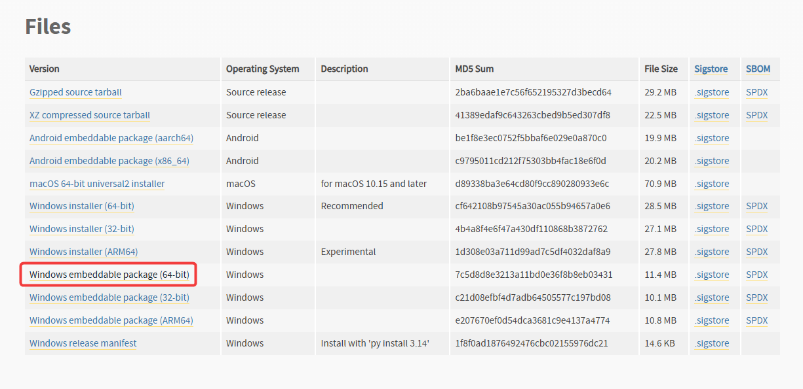

## 使用 Nuitka 编译

**编译:**

```shell
# 确认使用的是 python 3.12
po env use C:/Likianta/apps/python/3.12/python.exe

# 编译
por nuitka --standalone --onefile src/client.py

# 生成结果
#   .
#   |= client.build
#   |= client.dist
#   |= client.onefile-build
#   |- client.exe
```

这里生成的 "client.exe" 就是完整的可执行文件. 体积约 9MB.

这个体积还是有些超出我的期望了, 个人希望保持在 5MB 或更小.

**测试:**

```shell
# 帮助
./client.exe -h  # 见下图

# 假设我们的应用的前端端口为 3001, 后端为 3002.

# 1. 运行服务端
# 这里我们把 cwd 切换到 ../../../ (也就是 depsland 项目根目录), 
# 以便使用 depsland poetry 中的 streamlit.
cd <depsland_project>
strun 3001 sidework/mini_launcher/by_airmise/src/server.py
# 先手动打开 http://localhost:3001, 以激活应用.

# 2. 运行客户端
cd <this_project>
./client.exe localhost -f 3001 -b 3002
# 会自动打开浏览器访问 http://localhost:3001/?id=<client_id>
```



**效果图:**



开发者备忘 (一些注意事项):

- 不要用 Python 3.14 (截至 2025-10-15), 虽然 Nuitka 仍然能够编译, 但是尝试打开 exe, 会报 Segmentation Fault 错误.

- 减少依赖数量, 只保留必须的依赖 (`[tool.poetry.dependencies]`), 连 dev-dependencies 都不要写, 不然 Nuitka 生成的 exe 体积会骤然变大.

  比如说, 我这里如果把 dev-dependencies 中的 `# streamlit = ...` 解开注释, 那么生成的 exe 体积会从 9mb 变大为 17mb:

  

### 存在的问题

- Nuitka 增量编译需要 1~2min, 尽管不是很长, 但跟 V 相比, 仍然有些难以接受.

## 通过 V 编译

理由: 为了满足快速迭代和体积小这两个重要的需求, V 相较于 Nuitka 似乎能发挥更大的优势.

V 编译的思路是这样的:

1. 编写一个 src/client.v, 先检测并下载 python embed 压缩包, 解压然后运行 python 代码. 这样就解决了体积问题.
2. 使用 V 编译速度快得惊人, 满足了快速迭代的需求.

**编译**

```sh
v -o client.exe src/client.v
# 生成
#   .
#   |- client.exe  # ~400KB
```

### 编译 `airclient_standalone`

由 V 生成的 "client.exe" (400KB) 是一级启动器, 它的目的是寻找或下载二级启动器然后启动. 这里的二级启动器指的就是 "airclient_standalone", 它包含了一个 Python Embed 解释器和 airclient 源代码以及所需的所有依赖, 压缩后的体积为 10MB.

- Python Embed 解释器

  从 Python 官网寻找 embed 版本下载. 这里我用的是 [python-3.14.0-embed-amd64.zip](https://www.python.org/downloads/release/python-3140/).

  

  解压到 `./airclient_standalone/python`, 然后打开里面的 "python314._pth" 文件, 改为以下内容:

  ```
  python314.zip
  .
  import site
  ```

  然后创建一个 `./airclient_standalone/python/sitecustomize.py` 脚本:

  ```python
  import sys
  sys.path[0:0] = ['.', 'src', 'lib']
  ```

- airclient 源代码

  源代码是一个 py 文件, 已经同步在仓库, 拉取后就能看到: `./airclient_standalone/src/client.py`.

- 所需依赖

  这里指的是运行 airclient 所需的依赖. 不是很多, 为了确保体积小巧, 我们还用了依赖裁剪技术, 如下实施:

  ```sh
  cd <python_tree_shaking_project>
  pox -m tree_shaking build-module-graphs <this_project>/build/tree_shaking.yaml
  pox -m tree_shaking dump-tree <this_project>/build/tree_shaking.yaml
  # 生成结果: ./airclient_standalone/lib/*
  ```

将 "./airclient_standalone" 整个目录压缩成 7z 文件, 得到 "airclient_standalone.7z", **体积为 10MB**.

然后将压缩包放在 `<depsland_project>/chore/airclient_standalone.7z`.

### 提供下载链接

将上一节所说的压缩包放在 `<depsland_project>/chore/airclient_standalone.7z` 后, 运行以下命令:

```sh
cd <depsland_project>
dufs -p 2184 chore
```

这样, client.exe 就能通过 `http://<host>:2184/airclient_standalone.7z` 下载到这个文件了.


